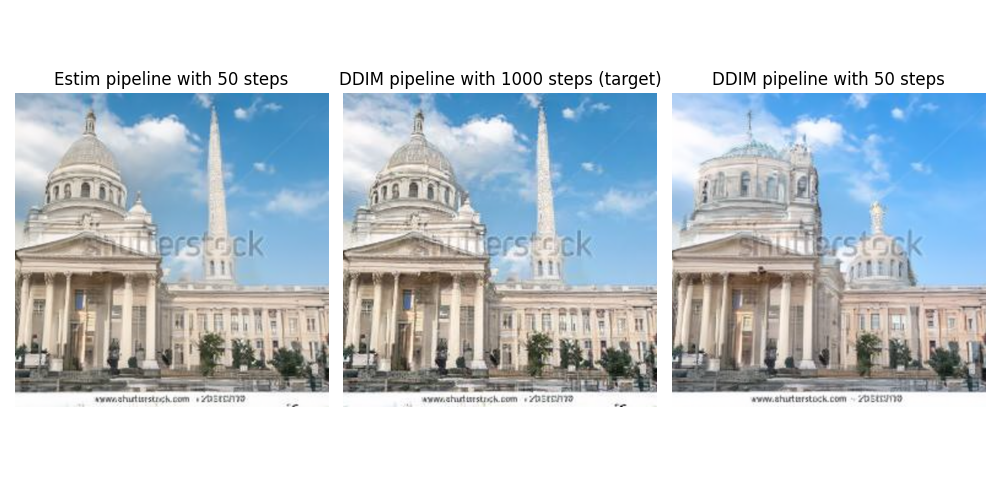

<p align="center">
    <br>
    
    <br>
<p>
<p align="center">
    <a href="https://github.com/huggingface/diffusers/blob/main/LICENSE">
        
    </a>
    <a href="https://github.com/huggingface/diffusers/releases">
        
    </a>
    <a href="CODE_OF_CONDUCT.md">
        
    </a>
</p>

This is HuggingFace diffusers plus a new pipeline called Estim. This new pipeline will generate images very similar to those generated with 1000 steps, by estimating the steps that it won't take instead of just skipping them.

*Image generated with Estim using around 50 steps*


## Prepration

You first have to install a few things (This goes if you want to use any of the diffusers pipelines)

    
```bash
pip install diffusers transformers accelerate scipy safetensors
```


## Modes

This pipeline has two modes for skipping the steps in diffusion models, the first one is the standard uniform skipping in which you can state the number of steps that you are willing to take. The second one, on the other hand, decides the best number of steps, on the fly, based on different factors, and it can reduce the number of steps to as low as 40.


## Generating Images

This is the same as any other pipeline, the only thing is that you can use Estim now. 


```python
from diffusers import EstimDiffPipeline


pipe = EstimDiffPipeline.from_pretrained("google/ddpm-cat-256").to("cuda")

im = pipe(num_inference_steps= 50  , threshold= args.Skip_threshold , uniform= True )
```

If you want to test it for different cases, you can also use the mai.py file presented here.
## Credits

This is the HuggingFace library and I just added the EstimDiff Pipeline to it.

## Citation

```bibtex
@misc{von-platen-etal-2022-diffusers,
  author = {Patrick von Platen and Suraj Patil and Anton Lozhkov and Pedro Cuenca and Nathan Lambert and Kashif Rasul and Mishig Davaadorj and Thomas Wolf},
  title = {Diffusers: State-of-the-art diffusion models},
  year = {2022},
  publisher = {GitHub},
  journal = {GitHub repository},
  howpublished = {\url{https://github.com/huggingface/diffusers}}
}
```
